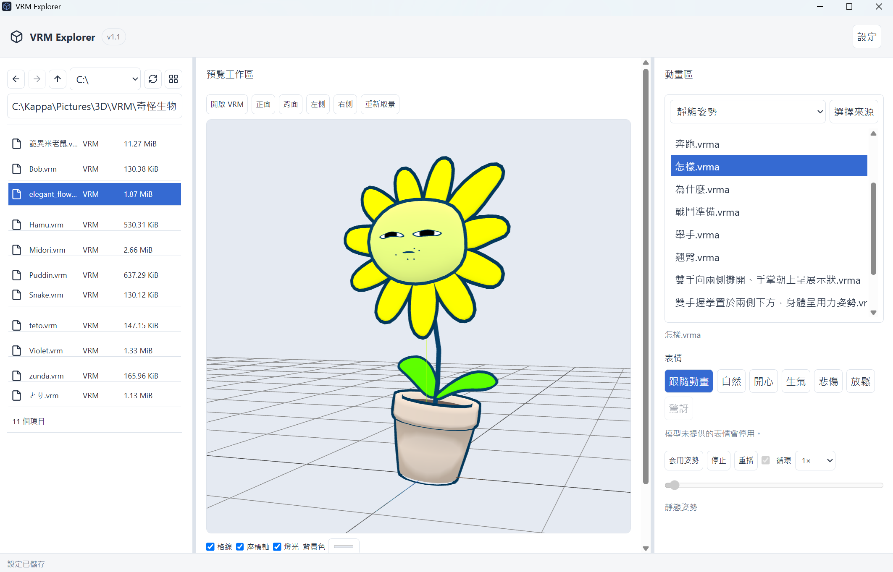

# VRM Explorer v1.1 (codex開發)

Windows 桌面 VRM／VRMA／圖片素材瀏覽與預覽工具。以離線使用及可攜式為優先，原始素材唯讀；繁體中文預設，支援英文介面。

## 下載

- [v1.1 Offline 可攜版（Windows x64，約 310 MiB）](https://github.com/kappalien/VRMExplorer/releases/download/v1.1.0/VRM-Explorer-1.1.0-Offline-win-x64.zip)
- [SHA-256 校驗碼](https://github.com/kappalien/VRMExplorer/releases/download/v1.1.0/VRM-Explorer-1.1.0-Offline-win-x64.zip.sha256)
- [所有發行版本](https://github.com/kappalien/VRMExplorer/releases)

一般使用者請下載上面的 Offline ZIP。GitHub 的 **Code → Download ZIP** 是原始碼，不能直接啟動。

目前發行目標為 **Windows 11 x64**。完整解壓後約 685 MiB，主要是隨附 Microsoft Fixed WebView2 Runtime 154.0.4258.62；使用程式不需安裝 Node.js、Rust 或 MSVC。

## 使用範例



左側選擇 VRM 檔案，中央預覽模型；右側選擇 VRMA 動畫或靜態姿勢，並切換模型支援的表情。圖中示範套用靜態姿勢。

展示模型 **elegant_flower／power_plant**，並非本專案製作，模型檔未隨程式提供。依所提供條款禁止模型再散布與法人使用；截圖僅供個人操作展示。[模型與第三方授權說明](docs/licensing.md)

## 快速開始

1. 將完整 ZIP 解壓至本機可寫入的資料夾。
2. 開啟其中的 `vrm-explorer.exe`。
3. 左側選擇磁碟或輸入資料夾路徑，雙擊資料夾進入，點選 `.vrm` 預覽。
4. 右側「選擇來源」選擇含 `.vrma` 的資料夾，掃描後點選檔名，再按「播放」。單幀靜態 VRMA 使用「套用姿勢」，可保持姿勢；「停止」會回復。

上次瀏覽資料夾、VRMA 來源與檢視方式會自動還原。請先閱讀包內 Microsoft Runtime 條款；使用與升級說明見 [Portable 發行文件](docs/portable-release.md)。

## 功能

- **檔案瀏覽**：上一個／下一個／上一層、磁碟選擇與路徑輸入。工具列的小圖示切換精簡清單／縮圖，維持工具列高度。
- **中央預覽**：VRM 0.x／1.0 預覽引擎、圖片預覽、旋轉與重新取景；滑鼠滾輪以游標位置為中心縮放。
- **動畫區**：獨立來源自動掃描、簡單檔名清單、播放／暫停／停止／重播、循環、速度與時間軸；支援長度為 0 的單幀姿勢。
- **表情**：自然、開心、生氣、悲傷、放鬆、驚訝及跟隨動畫；模型未提供的表情會停用。
- **設定頁面**：繁中／英文、淺色／深色／跟隨系統、檔案大小單位及快取。大小可選自動、B、KB／MB／GB、KiB／MiB／GiB。
- **Portable 資料**：設定、動畫索引、快取與 WebView 資料只寫在執行檔旁 `data/`，不會偷偷改寫到 AppData。
- **素材安全**：VRM、VRMA 與圖片唯讀；不執行外部 JavaScript、DLL Plugin 或遠端執行碼。

## v1.1 修正

- 單幀 VRMA 不再因動畫長度為 0 而被拒絕；以靜態姿勢套用，避免零長度循環計算。
- 模型缺少動畫中的可選骨骼時，交由官方綁定函式略過；完全沒有可用軌道的素材仍會拒絕。
- 加回小圖示切換精簡清單／縮圖，並保存檢視偏好。

## 資料與升級

程式旁的 `data/` 包含個人設定、SQLite 索引與快取。移動可攜版時，保留整個資料夾即可保留資料。

升級前關閉程式並備份 `data/`；新包中的 `upgrade.ps1` 會驗證發行檔案、更新 EXE 與 Runtime，保留使用者資料。詳細步驟與 Microsoft 授權／隱私聲明見 [Portable 說明](docs/portable-release.md)。

公開倉庫與可攜包皆不包含使用者模型、動畫、資料庫或個人設定。模型與動畫的使用權由素材原始授權決定。

## 開發與建置

需要 Windows、Git、Node.js／npm、Rust MSVC 工具鏈，以及 Visual Studio C++ Build Tools／Windows SDK。以下為 PowerShell 指令：

```powershell
git clone https://github.com/kappalien/VRMExplorer.git
cd VRMExplorer
npm ci
npm run tauri dev
```

常用檢查：

```powershell
npm test
npm run lint
npm run build
cargo test --manifest-path src-tauri/Cargo.toml --locked
cargo clippy --manifest-path src-tauri/Cargo.toml --locked --all-targets -- -D warnings
```

正式 Offline 封裝：

```powershell
powershell -File scripts/fetch-runtime.ps1
powershell -File scripts/build.ps1
```

`fetch-runtime.ps1` 從 Microsoft 取得鎖定的 Fixed Runtime、核對 CAB 雜湊與簽章，並取得官方條款。`build.ps1` 執行測試、建置與封裝，輸出至本機 `releases/`。同版本 ZIP 已存在時，封裝會拒絕覆寫。

若只需 UI 檢視，可以使用 `npm run dev`；瀏覽器模式不提供 Portable 檔案存取或設定保存。

## 測試狀態

v1.1 已執行並通過：**23 項 Vitest、17 項 Rust、4 項 Edge 測試**，以及 release build、lint、clippy、發行檔案雜湊與原生 Offline 啟動檢查。

Edge 測試可用 `npm run test:performance` 執行，需要 Microsoft Edge。VRM／VRMA 測試使用本機 `src/Vivian.vrm` 與 `src/Test.vrma`；這些使用者素材不公開，需自行提供可合法使用且符合測試假設的樣本。沒有樣本時，可先執行不依賴模型的 UI／虛擬列表測試：

```powershell
npx playwright test tests/performance/explorer-navigation.spec.ts tests/performance/virtual-list.spec.ts
```

乾淨離線 VM、Windows 10、非管理員、完整 DPI／GPU 矩陣、完整 VRM1／VRMA 相容性與原生單幀姿勢視覺驗證：**Not Tested**。詳見 [v1.1 測試記錄](docs/v1.1-tests.md) 與 [發行包驗證](docs/v1.1-release-verification.md)。

## 專案結構

| 路徑             | 用途                                             |
| ---------------- | ------------------------------------------------ |
| `src/`           | React／TypeScript 介面、預覽引擎與 i18n          |
| `src-tauri/src/` | Rust 檔案存取、Portable 設定、動畫索引與縮圖快取 |
| `scripts/`       | Runtime 取得、建置、封裝與升級                   |
| `tests/`         | 單元與 Edge 回歸測試                             |
| `docs/`          | 架構、使用、測試與開發記錄                       |

`node_modules/`、`src-tauri/target/`、`build/`、`releases/`、`data/` 與使用者 VRM／VRMA 不會進入 Git。原始碼、文件、截圖、第三方授權與 MPL 原始碼封存合計約 5.1 MiB；可攜 ZIP 另放 GitHub Release。

## 授權與署名 / Licensing

使用或再散布前請閱讀 [授權與素材說明](docs/licensing.md)。第三方授權及著作權聲明見 `licenses/third-party/`，MPL 元件原始碼見 `licenses/mpl-sources.zip`。Microsoft Runtime 與展示模型各有獨立條款。原創專案內容尚未指定開源授權；Public 不代表任意商用或再散布許可。

Third-party licenses, source availability and screenshot attribution are documented in [Licensing](docs/licensing.md). No general open-source license has been selected for original project content.

## English

VRM Explorer is a portable Windows desktop viewer for VRM avatars, VRMA animations and images. Download the **Offline release**, extract it into a writable local folder and run `vrm-explorer.exe`. Fixed WebView2 is included. Original assets are read-only; settings and cache stay in `data/` beside the executable.

v1.1 supports single-frame poses, compact/thumbnail view switching, cursor-centered zoom, animation playback and model-provided facial expressions. Traditional Chinese is the default language; English is available in Settings. See the linked test records for verified behavior and remaining **Not Tested** cases.

依根目錄 [開發規格](VRM_Explorer_Codex_Development_Spec.md) 開發。
